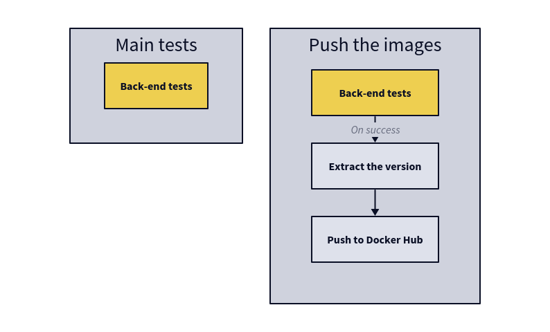

# Using Github Actions

The whole project --- with the database, back-end and proxy --- was
uploaded in a Git repository at https://github.com/e10e3/devops.

Let's focus on the back-end, arguably the most brittle part of our
system for now: the database and the HTTP server are more complex, but
we only configured them and suppose they are both more mature and more
tested. The Java app --- while we didn't write it ourselves --- is quite new and it was created from the ground
up (albeit using frameworks that help a bit).

Thankfully, the back-end has some tests written to ensure its
functionality. To run them all, we need to build the app. This is
easily done in one command with Maven:

```sh
sudo mvn clean verify
```

This launches two Maven targets: _clean_ will remove the temporary
directories, like `target` (the build directory). _verify_ will the
the application's tests#footnote[Maven has goal dependencies. This
means that in order to excute the goal _verify_ (the unit tests), it
will first run the unit tests (_validate_) and build the program
(_compile_), between others.].

Some of the tests are more encompassing (they are called _integration
tests_) and run in specialised Docker containers in order to have
total control on their environment.

> [!IMPORTANT]
> **Question 2-1**: _What are testcontainers?_
> 
> _Testcontainers_ is a testing library (https://testcontainers.org)
> that run tests on the codebase in lightweight Docker containers. In
> the context of Java apps, they execute JUnit tests.

## Yamllint is your friend

From now on, we'll use a tonne of YAML files. But the tools they
configure will fail if the file are improperly formatted.

_Yamllint_ is here to help! Running it on a file will give you a list
of all malformed items, like wrong indentation.

```yaml
# perhaps.yaml
key: on
enum:
  - name: Test
     kind: None
  - name: Other
```
```
$ yamllint perhaps.yaml
perhaps.yaml
  1:1       warning  missing document start "---"  (document-start)
  1:6       warning  truthy value should be one of [false, true]  (truthy)
  4:10      error    syntax error: mapping values are not allowed here (syntax)
```

YAML awaits you!

## Creating a workflow

Part of the DevOps philosophy is CI --- continuous
integration. Because our Git repository is hosted on GitHub, let's use
GitHub's own CI runner, GitHub Actions, to create a testing pipeline.

We created the file `.github/workflows/main.yml` to declare a
workflow that runs the integration tests:

```yaml
name: CI devops 2023
on:
  #to begin you want to launch this job in main and develop
  push:
    branches:
      - main
      - develop
  pull_request:

jobs:
  test-backend:
    runs-on: ubuntu-22.04
    steps:
     #checkout your github code using actions/checkout@v2.5.0 (upgraded to v4)
      - uses: actions/checkout@v4

     #do the same with another action (actions/setup-java@v3) that enable to setup jdk 17
      - name: Set up JDK 17
        uses: actions/setup-java@v3
        with:
          distribution: 'temurin'
          java-version: '17'
          cache: 'maven'

     #finally build your app with the latest command (not forgetting the tests)
      - name: Build and test with Maven
        run: mvn -B clean verify --file backend/pom.xml
```

Note: _checkout_ was updated to v4 because the previous version were
deprecated. The JDK version installed is version 17 (the
tried-and-true LTS version of the last few years), from the Eclipse
_temurin_ distribution.

The program is build with the command `mvn -B clean verify --file
backend/pom.xml`. The option `-B` is for "batch" (no colours are
needed for automation), and `--file` to indicate Maven it needs to use
the `pom.xml` file at the root of the backend as the job runs at the
root of the repository.

After a push to the remote repository, it runs with success.

> [!IMPORTANT]
> **Question 2-2**: _Document your Github Actions configurations._
>
>	The workflow reacts to two kinds of events: commit pushes on the
>	_main_ and _develop_ branches, and all pull requests.
>
>	When the workflow starts, it creates an environment on a machine
>	running Ubuntu 22.04, and checkouts the code that awoke it.
>
>	Then, it installs the Java JDK 17 and Maven. Once this is done, it
>	runs the back-end's unit tests.

## Automatically publish the images

In the previous part we created Docker images for the project's
components. The other great keyword of DevOps is CD --- continuous
deployment. Using GitHub Actions, we can create a workflow that
published the images to Docker Hub when code is pushed, no human
action required.

### Action secrets

Publishing to Docker Hub implies to log in, but we don't want to have
our credentials visible to anyone and their dog in clear on
GitHub. Fortunately, the forge has a solution, _secrets_.

We created the secrets `DOCKER_HUB_TOCKEN` and `DOCKER_HUB_USERNAME`
(the names are case-insensitive). `DOCKER_HUB_TOCKEN` contains a
dedicated access tocken from Docker Hub that only has read and write
permission, in order to push images.

### Pushing to Docker Hub

To push the newly built image to Docker Hub, a new job is created in
the same workflow file, called `build-and-push-docker-images`. Because we
only want to publish code that works at least a bit, it only runs it
the previous one (`test-backend`) finishes successfully.

After checking out the code like before, the job logs in to Docker Hub
using the secret credentials from the section "Action secrets" and the
action `docker/login-action`.

Then, it uses `docker/build-and-push` to build each image (database,
backend and frontend). If the current branch is `main`, it
additionally pushes the result to the Hub.

## Setup SonarCloud's Quality Gate

[SonarCloud](https://sonarcloud.io/) is a static analyser.  Its
role is to scan our app and tell what part of the code can be
improved, if the tests are sufficient, or if there are potential
security holes. It is an online service that can be called by Maven
when the app is built.

Once we register our project, we are provided with a token. Because we
want to call SonarCloud from our CI pipeline, we add the token to our
action secrets. The `backend-tests` job can now be amended to use the
following command for the tests:

```sh mvn -B clean verify sonar:sonar \
--file backend/pom.xml \
-Dsonar.token=${{ secrets.SONAR_TOKEN }} ```

Additionally, we need to add some metadata to our `pom.xml` for
SonarCloud to find its kitten:

```xml
<sonar.organization>e10e3</sonar.organization>
<sonar.host.url>https://sonarcloud.io</sonar.host.url>
<sonar.projectKey>e10e3_devops</sonar.projectKey>
```

And _voilà_! SonarCloud will now scan the code when the tests run, and
can alert you when it goes south. It will even post comments to you
pull requests!

Important note: because GitHub Actions are defined using YAML files,
it is really important to use multi-line strings if you want to split
your commands on multiple lines. To do this, add a pipe (`|`) or a
"greater than" (`>`) symbol after the key and start a new line. For
instance:

```yaml
---
key: |
  multi-line
  string!
```

## Fixing SonarCloud's alerts

SonarCloud raises two types of security warnings on the default
back-end code:

- The first ones are for potential unauthorised cross-origin access,
 because the annotation `@CrossOrigin` was added to the controllers.

- The second one warns about using database-linked data types as the
  input from endpoints. This could be exploited to overload the
  database.

In addition, but not blocking at first, the code coverage was reported
to be around 50%, where SonarCloud requires it to be above 80% for new
code.

Fixing the first set of warnings was easy: removing the incriminated
lines was enough. Since this is a simple case with only one route
(coming from the proxy), nothing important goes missing with this
deletion.

The second one is more involved. It is necessary to create a _data
transfer object_ (DTO) that will be the API's input, and will then be
transformed into the regular object. For this kind of object that hold
no logic, Java 14's records are perfect.

The DTO for the Student class is:

```java
public record StudentDto(
        String firstname,
        String lastname,
        Long departmentId) {
}
```

Because a new object is introduced, the function signatures change,
conversion needs to be handled, new service routines are added, the
tests must be adapted, etc. A little bit everywhere is needed to
secure the API.

And then, once the security is taken care of, SonarCloud complains
about the tests. "Clean code" fails. Indeed: it detects only 20% of
new code coverage. But the locally-run tests indicate 90%!

This is because the test coverage is not updated, so SonarCloud cannot
see it. The tool used for this is called
[JaCoCo](https://www.jacoco.org/jacoco/). The `jacoco:report`
goal needs to be added when the tests are run, and the option
`-Pcoverage` should be given to Sonar when called through Maven. After
this all, the coverage is updated and the pipeline passes.

Because I was looking at the tests, I used the opportunity to add some
missing tests for the original code, bringing the coverage to
97%[^1].

[^1]: The coverage with these tools cannot be 100%, because
some of the code cannot or has no point in begin tested
individually.

## Split pipelines

Our workflow work fine, but we want to refactor it in two separate
workflows.

We remove the `build-and-push-docker-image` job from the previous
workflow and add put it instead in its own workflow: "Push images".

The other one is renamed to "Run tests" for the occasion, and doesn't
change further.

On the "Push images" side, we set it to be triggered by the successful
termination of the tests workflow "Run tests", with the added
condition that it only runs is the active branch is `main`.

In the end, the behaviour is as so:

If located on main, develop or a pull request → run the tests\
If located on main and previous steps is successful  → push the images


## Automatic image version

Pushing the latest version of an image is cool, but isn't it _cooler_
for our images to have numbered versions?

What is needed is a system that makes so that the images that are
build get automatically assigned a version number when a tag is
pushed. Otherwise, they have the _main_ and _latest_ tag.

This is created by splitting the workflows in three:

- One workflow is a reusable one, it runs the tests on the back-end;

- One executes the preceding workflow (the reusable one) when a commit
  is pushed on _main_ or _develop_,

- The last one build and pushes the Docker images when a commit is
  made on _main_ or a tag is pushed. Before building, it runs the tests
  through the reusable workflow.

The calling jobs use the line `secrets: inherit` to transmit their
action secrets to the reusable workflow.

Additionally, in order to factor the image push (it is three times the
same thing), a matrix strategy is used for the various images we want:

```yaml
strategy:
  matrix:
    include:
      - image: e10e3/ops-database
        dockerfile: ./database
      - image: e10e3/ops-backend
        dockerfile: ./backend
      - image: e10e3/ops-frontend
        dockerfile: ./http
```

The image and Dockerfile are respectively accessed with `${{ matrix.image }}` and `${{ matrix.dockerfile }}`.

And indeed, with the workflows complete, pushing a
[semantic versioning](https://semver.org/) tag like `v1.1.0` pushes
[an image with the same tag](https://hub.docker.com/repository/docker/e10e3/ops-database/tags)
on Docker Hub.


