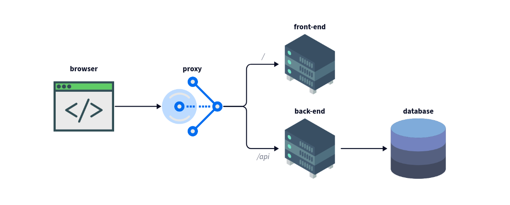

# A new front-end

As a further step, a front-end is introduced in the project.

In our case, since the reverse proxy was called "front-end", this
means we need to rename it everywhere. Here goes v2.

The front-end is found here:
<https://github.com/takima-training/devops-front>. It is a Vue app,
meaning a Node.js image is the base for the Dockerfile. But once Vue
compiled the code, JavaScript is no longer needed on the server side,
and the packaged `*.js` files can be distributed by a regular web
server.

The reverse proxy now has a use: it will distribute the traffic
between the back- and the front-end depending on the requested URL.

The proxy server needs to be reconfigured to handle the different
redirections.

```tcl
<VirtualHost *:80>
	ProxyPreserveHost On
	ProxyPass "/api/" "http://${BACKEND_CONTAINER_NAME}:8080/"
	ProxyPassReverse "/api/" "http://${BACKEND_CONTAINER_NAME}:8080/"
	ProxyPass "/" "http://${FRONTEND_CONTAINER_NAME}:80/"
	ProxyPassReverse "/" "http://${FRONTEND_CONTAINER_NAME}:80/"
</VirtualHost>
```
How the reverse proxy is configured in the HTTP server

The redirection is made as so:
- the traffic looking for `/api/*` will go to the back-end,
- the traffic looking for all other paths will go to the front-end.

The following architecture diagram shows the relation between the servers:



Since the front-end makes itself use of the API, it needs to make
calls to `/api/`, routing though the reverse proxy.

In order to deploy the front-end with the rest of the app, a service
was added to the Compose file, and a corresponding new role was
created in Ansible. They both use the same principles as were seen
before.

## More parametrisation

Because the proxy needs to access the back-end ans front-end servers'
container name, the occasion was used to further the parametrisation
of the configuration. Now, in addition of the database name, user and
password, the machine's hostname and the containers' name can be
indicated directly in the configuration#footnote[The hostname is not
decided by our app, so it cannot be changed on our side (the value is
still used), but all other variables are commands on what to set.].

## Changing environment variables at build time

Vue is configured at build time. It can be parametered with variables,
but it only uses variables from a defined set of files, depending on
what part of the lifecycle is wanted.

Thankfully these variables can be overridden with environment
variables from the host. But remember: it needs to happen at build
time.

In particular, it is needed to indicate what the base URL to access
the API is. Without it, the front-end cannot function. We know it is
`/api/`, but for _which_ host name? (Local use and server use require
different host names.)

To set this up, an environment variable is declared directly in the
Dockerfile; but its value is not static:

```dockerfile
ARG API_URL
ENV VUE_APP_API_URL ${API_URL}
```

This allows to change the value of `VUE_APP_API_URL` with the
`-build-arg` option. Compose supports this option, so the local
use-case is covered. For the general use-case, it is needed to go
through GitHub Actions: this is where the images are built. A workflow
variable was created, and the build argument uses this variable to
change the API URL.

```yaml
build-args: |
  API_URL=${{ vars.TARGET_HOSTNAME }}/api
```
